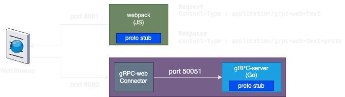
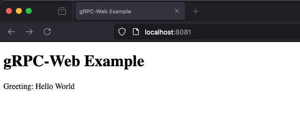

# gRPC-Web Example

This project demonstrates how to set up a simple gRPC-Web client and server with Envoy proxy.



# Quick Start

```shell
docker compose up -d
```

then open browser http://localhost:8081 (note: this demo uses **8081** and **8080** ports)



## Project Structure

- **client/**: Contains the gRPC-Web client code.
- **server/**: Contains the gRPC server code written in Go.
- **envoy/**: envoy configuration file.

## How to Run

### Prerequisites

- [Go](https://golang.org/doc/install)
- [Node.js and npm](https://nodejs.org/)
- [grpc-web](https://github.com/grpc/grpc-web)
- [protoc compiler](https://grpc.io/docs/protoc-installation/)

> NOTE: client-side and bi-directional streaming is not currently supported (see [streaming roadmap](https://github.com/grpc/grpc-web?tab=readme-ov-file))

# proto

```protobuf
syntax = "proto3";

package helloworld;

option go_package = "./proto"; // Add this line

service Greeter {
  rpc SayHello (HelloRequest) returns (HelloReply);
}

message HelloRequest {
  string name = 1;
}

message HelloReply {
  string message = 1;
}

```

# Server

```go
package main

import (
   "context"
   "google.golang.org/grpc/reflection"
   "log"
   "net"

   pb "github.com/ehsaniara/gRPC-web-example/proto"
   "google.golang.org/grpc"
)

type server struct {
	pb.UnimplementedGreeterServer
}

func (s *server) SayHello(ctx context.Context, in *pb.HelloRequest) (*pb.HelloReply, error) {
	return &pb.HelloReply{Message: "Hello " + in.Name}, nil
}

func main() {
	lis, err := net.Listen("tcp", ":50051")
	if err != nil {
		log.Fatalf("failed to listen: %v", err)
	}
	s := grpc.NewServer()
	pb.RegisterGreeterServer(s, &server{})

	// Register reflection service on gRPC server.
	reflection.Register(s)
	if err := s.Serve(lis); err != nil {
		log.Fatalf("failed to serve: %v", err)
	}

	log.Println("Server is running on port 50051")
	if err := s.Serve(lis); err != nil {
		log.Fatalf("failed to serve: %v", err)
	}
}
```

## client


```typescript
// Import the generated gRPC-Web client stubs and message classes
import {GreeterClient} from './generated/helloworld_grpc_web_pb';
import {HelloRequest} from './generated/helloworld_pb';

// Create an instance of the Greeter client
const client = new GreeterClient('http://localhost:8080');

// Function to send a greeting request
function sayHello(name) {
    // Create a new request
    const request = new HelloRequest();
    request.setName(name);

    // Call the sayHello method on the Greeter client
    client.sayHello(request, {}, (err, response) => {
        if (err) {
            console.error('Error:', err.message);
            document.getElementById('output').textContent = 'Error: ' + err.message;
        } else {
            console.log('Greeting:', response.getMessage());
            document.getElementById('output').textContent = 'Greeting: ' + response.getMessage();
        }
    });
}

// Example usage: sending a request when the page loads
document.addEventListener('DOMContentLoaded', () => {
    const name = 'World';
    sayHello(name);
});
```

run [generate.sh](client/generate.sh) to generate `*_pb.js` files, you need to have `grpc-web` and `protoc-gen-js` (its already generated `helloworld_grpc_web_pb.js` and `helloworld_pb.js`):
```shell
$ npm i grpc-web

$ npm install -g protoc-gen-js
```
